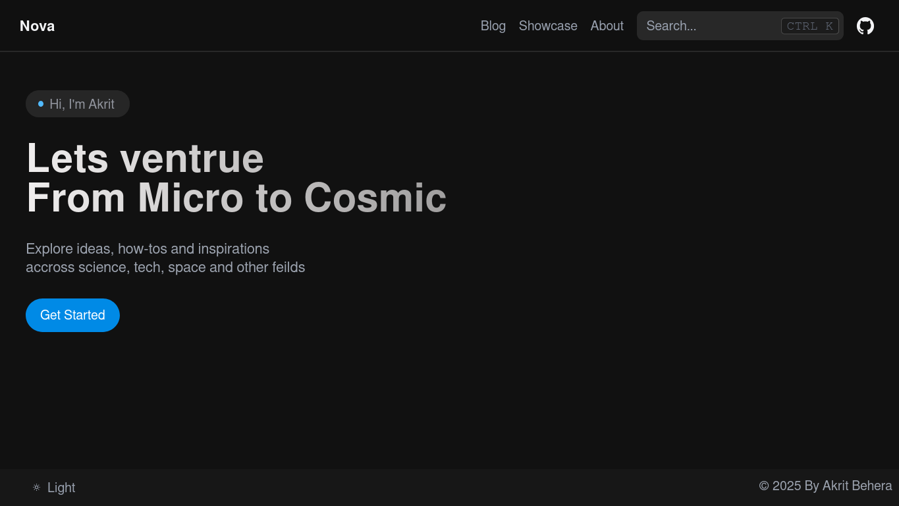

<h2 align="center">Nova</h2>

 

This website is created with a simple intention: to explore the world through words. It’s a space for thoughtful content that covers a diverse range of topics - from microbs to cosmics giants and more

### License

- All source code is licensed under the GNU Affero General Public License v3.0 (AGPL-3.0).
- All content in the `/content/` directory is licensed under the Creative Commons Attribution-NonCommercial-ShareAlike 4.0 International License (CC BY-NC-SA 4.0).
- All content in the `/static/` directory is licensed under the Creative Commons Attribution-NonCommercial-ShareAlike 4.0 International License (CC BY-NC-SA 4.0).

See `/content/LICENSE` and  `/static/LICENSE` for details

### Credits
Nova is heavily inspired by [Hextra](https://imfing.github.io/hextra/) and uses , [Hugo](https://gohugo.io/) , [Tailwind CSS](https://tailwindcss.com/) , [Heroicons](https://heroicons.com/) , [Nextra](https://nextra.vercel.app/) , [Next.js](https://nextjs.org/)